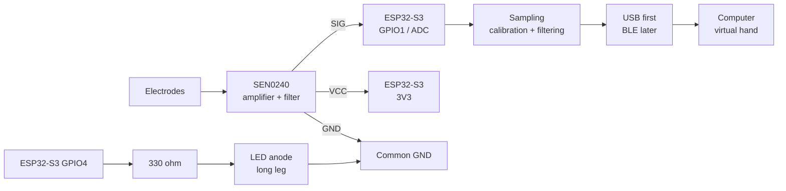

# Initial EMG Prototype Wiring

> **Status: verified on the bench, 2026-10-03**
>
> GPIO1 and GPIO4 were checked on this Waveshare board. `IO4` is GPIO4.
> The Gravity plug is labeled `A`, `+`, and `-`. On this cable those wires
> are blue, red, and black.

This document describes the first bring-up circuit: one SEN0240 EMG channel,
one analog input, and one software-controlled activity LED.

## Parts

- Waveshare ESP32-S3-DEV-KIT-N8R8
- DFRobot Gravity SEN0240
- 830-point solderless breadboard
- 5 mm LED
- 330 ohm resistor
- Dupont wires
- USB-A to USB-C data cable

## Connection overview

## Wiring table

### SEN0240 to ESP32-S3

| SEN0240 | ESP32-S3 | Purpose |
|---|---|---|
| `VCC` | `3V3` | Sensor power |
| `GND` | `GND` | Common reference |
| `SIG` | `GPIO1` | Analog EMG signal |

### Activity LED

| From | Through | To |
|---|---|---|
| `GPIO4` | `330 ohm` resistor | LED anode / long leg |
| LED cathode / short leg | — | `GND` |

The resistor may be placed on either side of the LED, but it must be in
series. The LED is driven by firmware from the measured EMG value; do not
connect it directly to `SEN0240 SIG`.

## Breadboard layout

1. Place the ESP32-S3 across the breadboard center gap.
2. Use one rail for `3V3` and one rail for common `GND`.
3. Connect `SEN0240 VCC` and `SIG` to separate rows.
4. Put the LED legs in separate rows.
5. Keep the resistor and LED in series.
6. Before powering on, visually confirm that `3V3` and `GND` are not joined.

The ESP32 stays beside the breadboard. Male-female Dupont wires join its pins
to the board. The LED circuit that blinked is:

| Breadboard | Connection |
|---|---|
| `a10` | wire from `IO4` |
| `b10` to `b15` | 330 ohm resistor, either way around |
| `c15` | LED long leg |
| `c20` | LED short leg |
| `a20` | jumper to the left blue `-` rail |
| left blue `-` rail, lower half | wire from ESP32 `GND` |

The red `+` rail is unused. The blue rail is split halfway along the board,
so the LED return and the ESP32 ground wire must share the lower half.

### SEN0240 cables

1. White 3-pin Gravity plug into the module socket. Red to `3V3`, black to ESP32 `GND`, blue to `IO1`.
2. Round electrode plug into the round jack on the module. The metal pad faces the skin. It never connects to a GPIO pin.

Unplug USB before moving those wires. Connect ground, then `3V3`, then the blue signal, and seat the white plug before power returns. Do not touch the blue signal to `3V3` or `5V` while that plug is in the module.

### Checks that passed

| Test | ADC result |
|---|---|
| `IO1` wired to `GND` | 0 |
| `IO1` wired to `3V3` | 4095 |
| Blue Gravity wire, from its contact in the white plug to `IO1`, driven by `3V3` | 4095 |
| Sensor powered, electrodes off the skin | about 1700–1800, spread of a few tens |
| Finger pressed across the three pads | spread up to about 500 |

A relaxed forearm does not by itself move the reading. The muscle under the pads has to contract. Moving the amplifier or its cable also moves the trace, because the electrode input is sensitive to cable motion.

## Bring-up sequence

1. Upload a basic LED blink program.
2. Confirm USB communication and serial output.
3. Connect only the LED circuit and test `GPIO4`.
4. Power down, connect `SEN0240 VCC`, `GND`, and `SIG`.
5. Read `GPIO1` over Serial and confirm that ADC values change.
6. Record the resting signal.
7. Record the signal during controlled muscle activation.
8. Add calibration, filtering, and software-based LED activation.

## Safety and electrical limits

- Use electrodes only on intact skin.
- Do not place electrodes on the chest or neck.
- Perform initial electrode tests from battery power.
- Verify the SEN0240 output voltage before connecting it to the ADC.
- The sensor signal must never exceed the ESP32-S3 input limit.
- Do not connect the sensor signal to a 5 V-only input.
- This prototype is not a medical device and must not be used for diagnosis or
  treatment.
