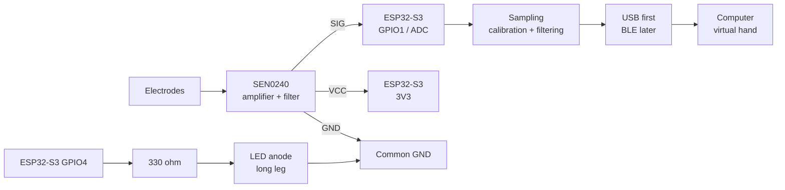

# Initial EMG Prototype Wiring

> **Status: preliminary**
>
> Confirm the labels and pinout on the physical boards before applying power.
> GPIO1 and GPIO4 are the proposed pins for the first prototype, not a
> substitute for checking the actual board documentation.

This document describes the first bring-up circuit: one SEN0240 EMG channel,
one analog input, and one software-controlled activity LED.

## Parts

- Waveshare ESP32-S3-DEV-KIT-N8R8
- DFRobot Gravity SEN0240
- 830-point solderless breadboard
- 5 mm LED
- 330 ohm resistor
- Dupont wires
- USB-A to USB-C data cable

## Connection overview

## Wiring table

### SEN0240 to ESP32-S3

| SEN0240 | ESP32-S3 | Purpose |
|---|---|---|
| `VCC` | `3V3` | Sensor power |
| `GND` | `GND` | Common reference |
| `SIG` | `GPIO1` | Analog EMG signal |

### Activity LED

| From | Through | To |
|---|---|---|
| `GPIO4` | `330 ohm` resistor | LED anode / long leg |
| LED cathode / short leg | — | `GND` |

The resistor may be placed on either side of the LED, but it must be in
series. The LED is driven by firmware from the measured EMG value; do not
connect it directly to `SEN0240 SIG`.

## Breadboard layout

1. Place the ESP32-S3 across the breadboard center gap.
2. Use one rail for `3V3` and one rail for common `GND`.
3. Connect `SEN0240 VCC` and `SIG` to separate rows.
4. Put the LED legs in separate rows.
5. Keep the resistor and LED in series.
6. Before powering on, visually confirm that `3V3` and `GND` are not joined.

Do not rely on wire colors. Read `VCC`, `GND`, and `SIG` from the labels on the
actual SEN0240 board.

## Bring-up sequence

1. Upload a basic LED blink program.
2. Confirm USB communication and serial output.
3. Connect only the LED circuit and test `GPIO4`.
4. Power down, connect `SEN0240 VCC`, `GND`, and `SIG`.
5. Read `GPIO1` over Serial and confirm that ADC values change.
6. Record the resting signal.
7. Record the signal during controlled muscle activation.
8. Add calibration, filtering, and software-based LED activation.

## Safety and electrical limits

- Use electrodes only on intact skin.
- Do not place electrodes on the chest or neck.
- Perform initial electrode tests from battery power.
- Verify the SEN0240 output voltage before connecting it to the ADC.
- The sensor signal must never exceed the ESP32-S3 input limit.
- Do not connect the sensor signal to a 5 V-only input.
- This prototype is not a medical device and must not be used for diagnosis or
  treatment.
